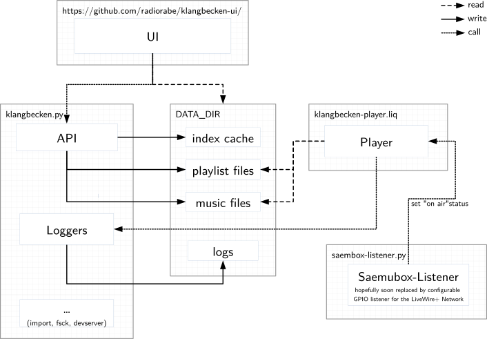

# Klangbecken: The RaBe Endless Music Player

[](https://travis-ci.org/radiorabe/klangbecken)
[](https://codecov.io/gh/radiorabe/klangbecken)

## API

### Dependencies

* Unix-like operating system environment
* **Python** 2.7 or >= 3.5
* **Werkzeug** library for the WSGI application
* **mutagen** library for audio tag editing
* **six** library for Python 2.7 and 3 compatibility
* **docopt** library for parsing command line arguments
* **ffmpeg** binary (>=4.0) for audio analysis

### Development dependencies:

 * virtualenv/venv, setuptools, pip
 * tox
 * coverage
 * mock
 * flake8

## Testing environment

### Using Docker

To get a working test environment with Docker, you need one container with Icecast and another with liquidsoap

0. Init Klangbecken data directory
    ```bash
    python klangbecken.py init
    ```

1. Start Klangbecken backend
    ```bash
    python klangbecken.py serve
    ```
2. Start the Icecast container
    ```bash
    sudo docker run --net host moul/icecast
    ```
3. Execute `klangbecken.liq`
    ```bash
    sudo docker run -ti --rm -v $PWD:/var/lib/liquidsoap -e KLANGBECKEN_DATA=data --net host radiorabe/liquidsoap klangbecken.liq
    ```
4. Also have a look at the logs
    ```bash
    sudo docker exec $(sudo docker ps -lq) tail -f /var/log/liquidsoap/klangbecken.log
    ```
5. Now you can open Klangbecken on http://localhost:5000 and the stream on http://localhost:8000
## System Overview

