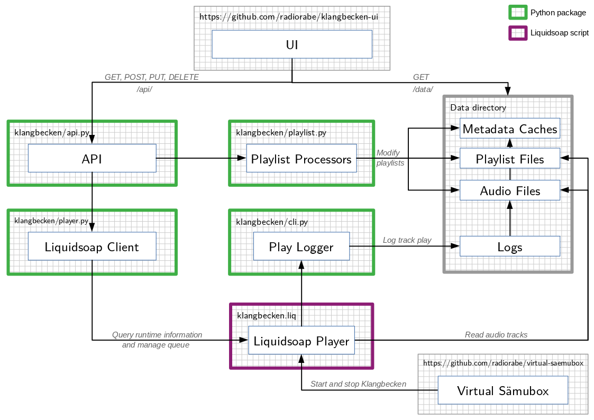

# Klangbecken

[](https://github.com/radiorabe/klangbecken/actions?query=workflow%3A%22Python+package%22)
[](https://github.com/radiorabe/klangbecken/actions?query=workflow%3A%22Liquidsoap+script%22)
[](https://github.com/psf/black)

_Klangbecken_ is the minimalistic endless music player for Radio Bern RaBe based on [liquidsoap](https://www.liquidsoap.info).

It supports configurable and editable playlists, jingle insertion, metadata publishing and more.

It is [designed](doc/design.md) for stand-alone operation, robustness and easy maintainability. All files are stored in a single [data directory](doc/data-dir.md).

This repository contains three components of the RaBe-Klangbecken:
* The [API](doc/api.md)
* The [command line interface](doc/cli.md)
* The [liquidsoap playout script](klangbecken.liq)

Two additional components are in their own repository:
* The listener for the current "on air" status, the [virtual Sämubox](https://github.com/radiorabe/virtual-saemubox).
* The web-based [UI](https://github.com/radiorabe/klangbecken-ui) for playlist editing.

How they interact can be seen in the [system overview diagram](doc/system-overview.png):



## System requirements
* Unix-like operating system environment
* **Python** (>= v3.7)
  * *docopt* library for parsing command line arguments
  * *Werkzeug* library (>= v2.0) for WSGI support
  * *PyJWT* library (>= v2.0) for creating and verifing JWT authentication tokens
  * *mutagen* library for audio tag editing
* **ffmpeg** binary (>= v2.8) for audio analysis
* **Liquidsoap** audio player (v1.3 _without_ inotify support)


## Setup

Clone the repository
```bash
git clone https://github.com/radiorabe/klangbecken.git
cd klangbecken
```

We strongly recommend to create a virtual environment (see [additional tools](doc/additional-tools.md)). E.g.
```bash
python -m venv .venv
source .venv/bin/activate
```

### Install dependencies
Install Python dependencies
```bash
pip install -r requirements.txt
```
Install `ffmpeg` with your system's package manager. E.g.
```bash
yum install ffmpeg
```
Install Liquidsoap (on CentOS 7 you can also use our prebuilt [package](https://github.com/radiorabe/centos-rpm-liquidsoap))
```bash
yum install opam
opam init
# we need liquidsoap 1.3.7 which does not run after OCaml 4.07.0
opam switch create klangbecken 4.07.0
opam depext alsa mad lame vorbis taglib liquidsoap.1.3.7
opam install alsa mad lame vorbis taglib liquidsoap.1.3.7
eval $(opam env)
```

Install the client UI:
```bash
cd ..
git clone https://github.com/radiorabe/klangbecken-ui
cd klangbecken-ui
npm install
```

### Run the programs

Initialize the data directory:
```bash
python -m klangbecken init
```

Run the development API server:
```bash
python -m klangbecken serve
```

Run the client UI development server:
```bash
cd ../klangbecken-ui
npm run serve
```

Browse to http://localhost:8080 and start uploading audio files.

Run the liquidsoap audio player:
```bash
eval $(opam env)
liquidsoap klangbecken.liq
```

Manually set the onair status of the player using `netcat`:
```bash
echo "klangbecken.on_air True" | nc -U -w 1 klangbecken.sock
```


## Development

### Python Package

The Python code is tested with a test suite and follows the flake8 coding guidelines.

Before submitting your code make sure that ...

1. ... you have installed the test dependencies
   ```bash
   pip install -r requirements-test.txt
   ```

2. ... the test suite runs without failure
   ```bash
   python -m unittest discover
   ```
3. ... all your code is covered by unit tests
   ```bash
   coverage run -m unittest discover
   coverage report
   ```
4. ... your code follows the coding style guidelines
   ```bash
   flake8
   ```

#### Recommended Tools (_optional_)

We recommend the use of `tox`, `black` and `isort` for development.
```bash
pip install tox black isort
```
##### tox
Instead of running all the above commands manually, `tox` lets you run them all at once for all installed Python versions. Make sure to have at least the Python version additionally installed, that is used in production (currently Python 3.9). `tox` is also what we use in continous integration, so using it locally helps you to make your code pass it. To call it simply type:
```bash
tox
```

##### black
Manually fixing coding style mistakes is a pain. `black` formats your code automatically.
```bash
black .
```

##### isort
Finally, `isort` helps to consistantly organize package imports.
```bash
isort .
```

All development tools are preconfigured in [`setup.cfg`](setup.cfg). For additional tools and tips & tricks and  see [additional tools](doc/additional-tools.md).

### Liquidsoap Script

Liquidsoap lets you syntax check and type check your script:
```bash
liquidsoap --check klangbecken.liq
```

## Deployment

The deploy script `deploy.sh` automates deploying the code.

_Preparation:_
* Configure a remote repository `upstream` pointing at the upstream repository (https://github.com/radiorabe/klangbecken).
* Configure git to automatically fetch tags from `upstream/master`:
  ```bash
  git config remote.upstream.tagOpt --tags
  ```
* Configure a remote `prod` pointing at the repository on the production system.
* Pull the latest version from `upstream`:
  ```bash
  git pull upstream master --ff-only
  ```
* Verify that the code you want to deploy passed continuous integration.
* Make sure that your working directory is clean.

_Run the script:_
```bash
./deploy.sh [--no-mod-wsgi]
```
It perfoms the following steps:
- Increment and commit a new version number.
- Download all run-time dependencies.
- Optionally download `mod_wsgi` (requires `httpd-devel` libraries to be installed locally).
- `scp` the dependencies to production.
- Push your code to production.
- Install all dependencies in production.
- Install the Python package (API and CLI) in production.
- Reload the web server to load the new API code.
- Copy the liquidsoap script to it's destination.
- If everything was successful, tag the current commit with the new version number, and push it to the `upstream` repository.

_Finalize deployment:_
- If the liquidsoap script (`klangbecken.liq`) changed, restart the liquidsoap player during a "off air" moment:
  ```bash
  systemctl restart liquidsoap@klangbecken
  ```
