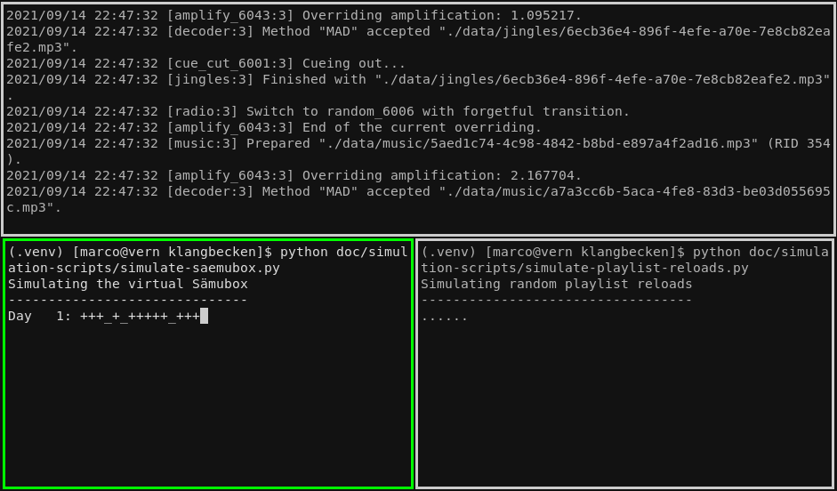

# Accelerated Simulation Runs

By shortening the track duration by a factor 100 we can cover a day in 15 minutes and an overnight run can produce a month' worth of runtime data. This data can then be analyzed to verify various aspects of the player script.

## Preparation

### Calculate playlist properties _(optional)_

Copy the `index.json` file from production:
```bash
scp klangbecken-prod-system:/var/lib/klangbecken/index.json index-orig.json
```

Let's see what kind of tracks we have:
```python
import json
from statistics import mean, pstdev
data = json.load(open("index-orig.json"))

for playlist in "music classics jingles".split():
    durations = [entry["cue_out"] - entry["cue_in"] for entry in data.values() if entry["playlist"] == playlist]
    avg = mean(durations)
    print(f"{playlist.capitalize()} playlist: {len(durations)} tracks, {avg:.2f}±{pstdev(durations, avg):.2f} seconds (min: {min(durations):.2f}s, max: {max(durations):.2f}s)")
```

Example output:
```
Music playlist: 1334 tracks, 230.63±70.46 seconds (min: 29.24s, max: 610.49s)
Classics playlist: 1280 tracks, 240.21±70.19 seconds (min: 43.69s, max: 975.89s)
Jingles playlist: 22 tracks, 11.31±16.53 seconds (min: 2.24s, max: 76.49s)
```

### Adjust code

Some code needs to be adjusted, to make the player and import run as desired with the shortened track length.

Apply the supplied patch before running the simulation:
```bash
patch -p1 < doc/simulation-timing-changes.patch
```

**Attention:** Make sure, that you do not accidentally commit these changes.

After running the simulation you can revert the changes:
```bash
patch -p1 -R < doc/simulation-timing-changes.patch
```

##### Applying changes manually _(optional)_

Comment out the section that checks the track length in the `ffmpeg_analyzer` function in the [playlist code](../klangbecken/playlist.py).
```python
    # WARNING: do not commit
    # duration = cue_out - cue_in
    # if playlist != "jingles" and duration < 5.0:
    #     raise UnprocessableEntity(f"Track too short: {duration} < 5 seconds")
    # elif playlist == "jingles" and duration < 0.5:
    #     raise UnprocessableEntity(f"Track too short: {duration} < 0.5 seconds")
```

Adjust timings in the [player code (klangbecken.liq)](../klangbecken.liq):

Divide waiting times (before repeating a track) by 100:
```txt
# WARNING: do not commit
if playlist == "music" then  1728.0 # 2 days / 100
elsif playlist == "classics" then 1728.0 # 2 days / 100
elsif playlist == "jingles" then 36.0 # 1 hour / 100
```

Make jingles run 6 times a minute (15 mins / 100 ≈ 10 seconds):
```txt
# WARNING: do not commit
jingle_times = [0s, 10s, 20s, 30s, 40s, 50s] #[5m0s, 20m0s, 35m0s, 50m0s]
```

Divide fade in times when starting the klangbecken by 100:
```txt
# WARNING: do not commit
restart_delay = interactive.float("restart.delay", .01)
restart_fade = interactive.float("restart.fade", .01)
```

Divide the crossfade times by 100:
```txt
# WARNING: do not commit
radio = crossfade(start_next=.005, fade_out=.01, fade_in=0., radio)
```

### Generate audio files

Optionally modify the script [`generate-tracks.py`](simulation-scripts/generate-simulation-tracks.py) with the values generated in the beginning (don't forget to divide the durations by 100), or just leave the default values in place.

Run the script:
```bash
python doc/simulation-scripts/generate-tracks.py
```

Grab a drink 🥤.

### Import audio files

Clear your data directory and rebuild it with the `init`-command:
```bash
mv data data.bak
mv klangbecken.log klangbecken.log.bak
python -m klangbecken init
```

Import the generated tracks:
```bash
python -m klangbecken import -y music sim-data/music-*.mp3
python -m klangbecken import -y classics sim-data/classic-*.mp3
python -m klangbecken import -y jingles sim-data/jingle-*.mp3
```

Again, this might take a while ⏳.

Start the API, player and the user interface to modify the priority of some jingles.

API:
```bash
python -m klangbecken serve
```

Player:
```bash
$(opam eval)
liquidsoap klangbecken.liq
```

User interface:
```bash
cd ../klangbecken-ui
npm run serve
```

Go to http://localhost:8080/jingles and set different priorities for jingles. You should disable at least on track by setting its priority to zero.

Finally, make sure everything is in fine order:
```bash
python -m klangbecken fsck
```

## Run simulation

Start the liquidsoap player:
```bash
rm klangbecken.log   # clean the log file
eval $(opam env)
liquidsoap klangbecken.liq
```

Start the [virtual Sämubox simulator](simulation-scripts/simulate-saemubox.py), that takes the player on and off air in random hourly intervals:
```bash
python doc/simulation-scripts/simulate-saemubox.py
```

Start the [playlist reload script](simulation-scripts/simulate-playlist-reloads.py), that simulates playlist editing in random intervals:
```bash
python doc/simulation-scripts/simulate-playlist-reloads.py
```



Watch the simulation util you get tired. Go to sleep 💤.

_Note_: Let the simulation run at least for a couple of hours to get meaningful results.

## Analysis

After stopping everything, run the analysis script:
```bash
python doc/simulation-scripts/analysis.py
```

Example output of a two month simulation:
```
1. Did errors occur?
--------------------
✅ No

2. State of the data directory still good?
------------------------------------------
✅ Yes

3. Did all played tracks get logged?
------------------------------------
✅ Yes (17727 track plays)

4. Ratio music vs. classics
---------------------------
✅ Good: 5.00 to 1

5. Music play distribution
--------------------------
✅ Normal distribution: 9.02±2.03

6. Classics play distribution
-----------------------------
✅ Normal distribution: 1.88±1.28

7. Weighted jingle play distribution
------------------------------------
✅ Normal distribution: 66.82±9.49

8. Disabled jingles not played?
-------------------------------
✅ Yes

9. Jingle weights respected?
----------------------------
✅ Yes

10. Are Jingles played regularly?
---------------------------------
✅ Yes

11. Waiting time between track plays (music & classics) respected?
------------------------------------------------------------------
✅ Waiting periods almost always met: 2 missed out of 14434 (0.014%)
```
